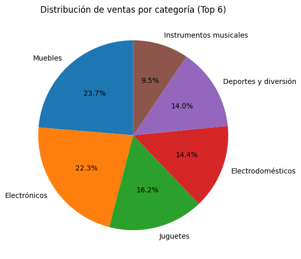
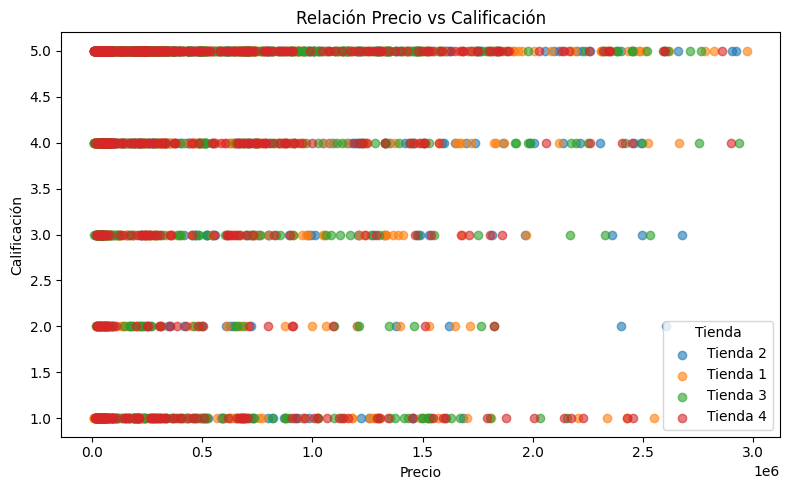
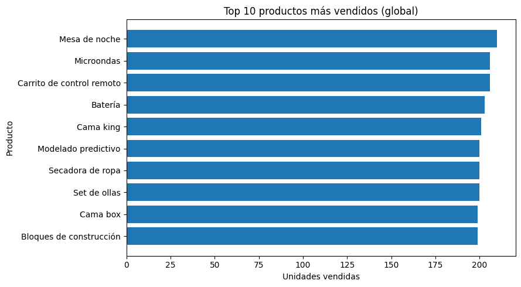

<h1>Alura Store 📊</h1>

¡Bienvenido al análisis de <strong>Alura Store</strong>! Este proyecto corresponde al primer desafío de Data Science de Alura Latam. 
El objetivo es ayudar al Sr. Juan a decidir qué tienda de su cadena debería vender para iniciar un nuevo emprendimiento. 
Se utilizan datos de ventas, categorías, reseñas y costos de envío de 4 tiendas.

<h2>Características ✨</h2>
<ul>
    <li><strong>Análisis de ingresos</strong>: Se calculan los ingresos totales de cada tienda.</li>
    <li><strong>Categorías</strong>: Identifica las categorías de productos más y menos vendidas por tienda.</li>
    <li><strong>Calificaciones</strong>: Calcula el promedio de calificaciones de clientes por tienda.</li>
    <li><strong>Productos</strong>: Detecta los productos más y menos vendidos en cada tienda.</li>
    <li><strong>Costos de envío</strong>: Calcula el costo promedio de envío de cada tienda.</li>
    <li><strong>Visualizaciones variadas</strong>: Gráficos de barras, líneas, dispersión y pastel para interpretar mejor los datos.</li>
</ul>

<h2>Cómo usar 🚀</h2>
<ol>
    <li><strong>Clonar el repositorio</strong>:
        <pre><code>git clone https://github.com/Jeimmy12/challenge1-data-science.git</code></pre>
    </li>
    <li><strong>Instalar dependencias</strong>:
        <pre><code>pip install -r requirements.txt</code></pre>
    </li>
    <li><strong>Abrir el notebook</strong>:
        <pre><code>jupyter notebook AluraStoreLatam.ipynb</code></pre>
    </li>
    <li>Ejecuta las celdas paso a paso para obtener las métricas y visualizaciones.</li>
</ol>

<h2>Estructura del proyecto 📂</h2>
<pre>
alura-store/
│
├── data/
│   ├── tienda_1.csv
│   ├── tienda_2.csv
│   ├── tienda_3.csv
│   └── tienda_4.csv
│
├── imgs/                  # Gráficas exportadas
│   ├── ingresos_por_tienda.png
│   ├── calificacion_promedio.png
│   ├── distribucion_categorias.png
│   ├── dispersion_precio_calificacion.png
│   ├── distribucion_categorias.png
│   └── top_productos.png
│
├── AluraStoreLatam.ipynb  # Notebook con el análisis
└── README.md
</pre>

<h2>Tecnologías utilizadas 💻</h2>
<ul>
    <li><strong>Python</strong>: Lenguaje principal para el análisis.</li>
    <li><strong>Pandas</strong>: Manipulación y análisis de datos.</li>
    <li><strong>Matplotlib</strong>: Creación de gráficos.</li>
    <li><strong>Jupyter Notebook</strong>: Entorno interactivo para análisis.</li>
</ul>

<h2>Resultados 📊</h2>
<h3>Ingresos totales por tienda</h3>

<h3>Calificaciones promedio</h3>

<h3>Distribución de ventas por categoría</h3>

<h3>Relación entre precio y calificación</h3>

<h3>Top 10 productos más vendidos</h3>

<h2>Conclusión ✅</h2>

Tras analizar los datos, se recomienda que el Sr. Juan venda la tienda con <strong>menor ingreso total, calificación más baja y mayores costos de envío</strong>, ya que es la menos eficiente. 
Según el análisis es <strong>Tienda 1</strong>
Esto permitirá enfocar los recursos en las tiendas más rentables y con mejor aceptación de clientes.

<h2>Contribuir 🤝</h2>

¡Las contribuciones son bienvenidas! Si deseas mejorar este proyecto:

<ol>
    <li>Haz un fork del repositorio.</li>
    <li>Crea una rama (<code>git checkout -b nueva-funcionalidad</code>).</li>
    <li>Haz tus cambios y commits (<code>git commit -m 'Agrega nueva funcionalidad'</code>).</li>
    <li>Haz push (<code>git push origin nueva-funcionalidad</code>).</li>
    <li>Abre un Pull Request.</li>
</ol>

<h2>Autor ✒️</h2>
<ul>
    <li><strong>Tu Nombre</strong></li>
    <li>GitHub: <a href="https://github.com/tu-usuario">tu-usuario</a></li>
</ul>

¡Gracias por visitar mi proyecto <strong>Alura Store</strong>! 🎉 
Este es el reto de análisis de datos de Alura Latam. 🚀

